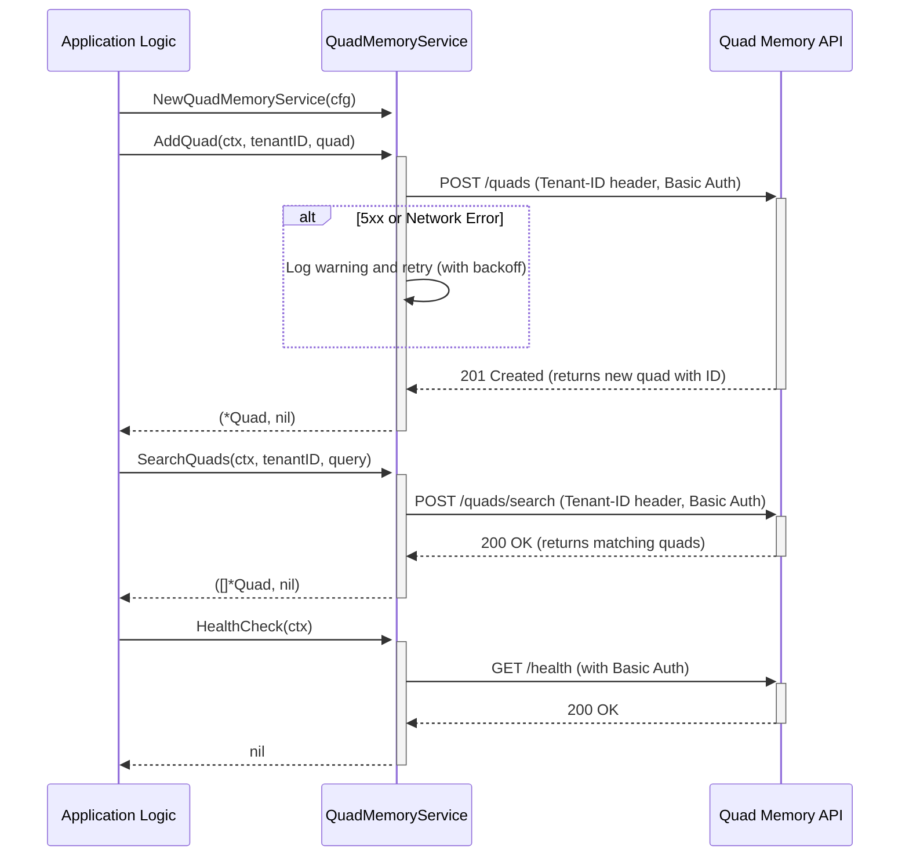

# Design: Quad Memory Client

## 1. Overview

This document details the design for the `QuadMemoryService`, a Go client for a local quad memory REST service. The client will provide a simple, intuitive, and resilient interface for adding, searching, and managing quads (subject-predicate-object-context) within a multi-tenant environment. It handles underlying HTTP communication, authentication, logging, and error handling.

## 2. Architecture

The `QuadMemoryService` is a client library within the `adk-golang` application. It encapsulates the logic for interacting with an external, RESTful quad memory service, including tenancy, authentication, and retry logic.



## 3. Components and Interfaces

The main component will be the `QuadMemoryService` struct and its associated methods, all located in `pkg/memory/quad_memory_service.go`.

### 3.1. `QuadMemoryService` Struct and Config

```go
// QuadMemoryConfig holds the configuration for the client.
type QuadMemoryConfig struct {
    BaseURL    string
    Username   string
    Password   string
    MaxRetries int
    // Initial backoff duration for retries, e.g., 500ms
    RetryBackoff time.Duration
}

// QuadMemoryService communicates with a remote quad memory service.
type QuadMemoryService struct {
    config     QuadMemoryConfig
    httpClient *http.Client
    logger     *zap.SugaredLogger
}
```

### 3.2. Public Functions and Methods

```go
// NewQuadMemoryService creates a new client instance from a config.
func NewQuadMemoryService(config QuadMemoryConfig) *QuadMemoryService

// HealthCheck verifies the service is available.
func (s *QuadMemoryService) HealthCheck(ctx context.Context) error

// AddQuad adds a new quad to the memory for a specific tenant.
func (s *QuadMemoryService) AddQuad(ctx context.Context, tenantID string, quad Quad) (*Quad, error)

// SearchQuads finds quads matching a query for a specific tenant.
func (s *QuadMemoryService) SearchQuads(ctx context.Context, tenantID string, query QuadSearchQuery) ([]*Quad, error)
```

## 4. Data Models

The following Go structs will be defined for API interaction.

```go
// Quad represents a subject-predicate-object-context statement.
type Quad struct {
    ID      string `json:"id,omitempty"`
    Subject string `json:"subject"`
    Predicate string `json:"predicate"`
    Object  string `json:"object"`
    Context string `json:"context,omitempty"`
}

// AddQuadRequest is the payload for adding a quad.
type AddQuadRequest struct {
    TenantID string `json:"tenant_id"`
    Quad     Quad   `json:"quad"`
}

// QuadSearchQuery defines the criteria for a search.
type QuadSearchQuery struct {
    Subject   string `json:"subject,omitempty"`
    Predicate string `json:"predicate,omitempty"`
    Object    string `json:"object,omitempty"`
    Context   string `json:"context,omitempty"`
}

// SearchQuadsRequest is the payload for searching quads.
type SearchQuadsRequest struct {
    TenantID string          `json:"tenant_id"`
    Query    QuadSearchQuery `json:"query"`
}
```

## 5. Error Handling and Resilience

-   **Context Errors:** All public methods will respect `context.Context`.
-   **Request/HTTP/JSON Errors:** Standard errors will be wrapped and returned.
-   **API Errors:** Non-2xx responses will be converted into a Go error, including status code and body. 4xx errors will not trigger retries.
-   **Retry Logic:** The client will implement an optional retry mechanism for transient errors (network issues, 5xx status codes).

## 6. Logging

The client will use the global `zap.SugaredLogger` provided by `pkg/logger/logger.S()` to log important events.

## 7. Testing Strategy

-   **Unit Tests:** Unit tests will be written in `pkg/memory/quad_memory_service_test.go`.
-   **Mocking:** The external HTTP service will be mocked using `net/http/httptest`.
-   **Test Cases:**
    -   Test successful creation, searching, and health checks.
    -   Test correct setting of `Authorization` and `Tenant-ID` headers.
    -   Test error handling for API errors (4xx, 5xx).
    -   Test retry logic for 5xx errors and network failures.
    -   Test context cancellation/timeout during requests and retries.
